# Enhancing Heuristic Search with Neural Networks
Heuristic search algorithms, such as A*, Weighted A* (WA*), and Batch Weighted A* (BWA*), are crucial for solving complex combinatorial problems, where the effectiveness of the heuristic significantly impacts the efficiency and success of the search process. These algorithms rely on heuristics to guide the search towards the goal state, balancing exploration and exploitation to enhance performance. Traditionally, heuristics are static and manually designed, limiting their adaptability and optimization potential.

In this project, we explore the use of neural networks to learn heuristics through a bootstrapping method. The neural network is trained to predict heuristic values based on data generated by a basic heuristic and applied within search algorithms like A*, WA*, and BWA*. While the learned heuristic may not be admissible—due to possible overestimations by the neural network—our objective is to harness the flexibility and learning capabilities of neural networks to develop a heuristic that leads to fewer node expansions on average compared to the traditional heuristic.

We apply this approach to the TopSpin puzzle, a challenging combinatorial problem, to demonstrate how integrating neural networks into the heuristic search process can significantly enhance search efficiency. Our goal is to show that a search algorithm utilizing learned heuristics will expand fewer nodes on average than one using a basic heuristic, thereby improving overall search performance even if the learned heuristic does not guarantee admissibility.

## Neural Network Architecture

The following diagram illustrates the architecture of the neural network used in our project:

```mermaid
graph LR
    Input[Input] --> FC1[FC1 256]
    FC1 --> |Dropout 0.3| FC2[FC2 128]
    FC2 --> Attention[Multi-Head Attention]
    Attention --> FC3[FC3 128]
    FC3 --> |Dropout 0.3| FC4[FC4 64]
    FC4 --> |Dropout 0.3| FC5[FC5 16]
    FC5 --> |Dropout 0.3| FC6[FC6 1]
    FC6 --> Output[Output]

    %% Residual connections
    FC1 -.-> |Identity| FC2
    FC2 -.-> |Residual| FC3
    FC3 -.-> |Identity| FC4
    FC4 -.-> |Identity| FC5

    classDef fc fill:#f9f,stroke:#333,stroke-width:2px;
    classDef attention fill:#ff9,stroke:#333,stroke-width:2px;
    classDef io fill:#9ff,stroke:#333,stroke-width:2px;
    class FC1,FC2,FC3,FC4,FC5,FC6 fc;
    class Attention attention;
    class Input,Output io;
```

## Provided Source Codes

1. `TopSpinState.py` represents a state in the TopSpin puzzle.
2. `SearchAlgorithms.py` implements A*, Weighted A*, and Batch Weighted A* search algorithms for solving the TopSpin puzzle, including node management and state transitions.
3. `heuristics.py` defines a neural network-based heuristic model for the TopSpin puzzle, including random state generation and bootstrapping methods for training the model.
4. `training.py` provides a training for a bootstrapping heuristic using various search algorithms, generating training data with a base heuristic, and performing iterative model training with early stopping based on loss improvements.
5. `expiremnets.py` runs experiments to evaluate different heuristics using search algorithms, measures performance metrics like runtime, path length, and number of expansions.
